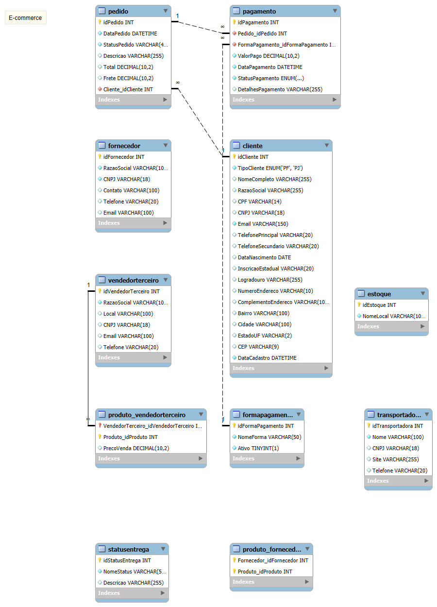

# Projeto de Modelagem de Banco de Dados: Cenário de E-commerce

## Visão Geral do Projeto

Este projeto apresenta a modelagem de um banco de dados relacional para um cenário de e-commerce, focado em clientes, pedidos, produtos, estoque, fornecedores, vendedores terceiros e processos de pagamento e entrega. O objetivo principal é demonstrar a capacidade de modelar um sistema transacional complexo, atendendo a requisitos específicos de negócio.

## Modelo Lógico do Banco de Dados

O esquema do banco de dados foi projetado conforme o diagrama abaixo, que representa a estrutura lógica das tabelas e seus relacionamentos.

## Características e Refinamentos da Modelagem

A modelagem foi desenvolvida para incorporar os seguintes pontos-chave:

1.  **Cliente (Pessoa Física e Jurídica):**
    * A tabela `cliente` foi unificada para gerenciar tanto Pessoas Físicas (PF) quanto Pessoas Jurídicas (PJ).
    * Um campo `TipoCliente` (ENUM 'PF', 'PJ') diferencia o tipo de cliente.
    * Campos como `CPF` e `CNPJ` estão presentes na mesma tabela, sendo preenchidos de acordo com o `TipoCliente` (garantindo que uma conta seja PJ ou PF, mas não ambas simultaneamente através de regras de negócio ou validação na aplicação).

2.  **Pagamento (Múltiplas Formas por Pedido):**
    * A relação entre `pedido` e `pagamento` é de **Um para Muitos (1:N)**. Isso permite que um único pedido possa ser associado a múltiplos registros de pagamento, viabilizando cenários como pagamentos parcelados ou o uso de diferentes métodos de pagamento para um mesmo pedido.
    * A tabela `pagamento` está ligada a `forma_pagamento`, que lista os métodos disponíveis (e.g., Cartão de Crédito, Boleto, Pix).

3.  **Entrega (Status e Código de Rastreio):**
    * A tabela `pedido` inclui um campo `CodigoRastreio` para acompanhar o envio.
    * Existe uma relação com a tabela `status_entrega` para gerenciar os diferentes estágios do processo de entrega (e.g., "Pendente", "Em Trânsito", "Entregue").
    * A tabela `transportadora` permite vincular o pedido à empresa responsável pela entrega.

## Implementação (Opcional - Se você for adicionar os scripts SQL depois)

Este projeto pode ser complementado com a implementação do esquema em um SGBD (Sistema Gerenciador de Banco de Dados) como o MySQL, incluindo scripts para:
* Criação do esquema (`ecommerce_schema.sql`)
* Inserção de dados de teste (`ecommerce_test_data.sql`)
* Consultas SQL para análise de dados (`ecommerce_queries.sql`)

## Ferramentas Utilizadas (Opcional)

* **Ferramenta de Modelagem ERD:** Para a criação do diagrama lógico (`E-commerce_Mod_Simples.png`).
* **GitHub:** Para versionamento e hospedagem do projeto.

---
**Desenvolvido como parte de um desafio de projeto de Modelagem de Banco de Dados.**
